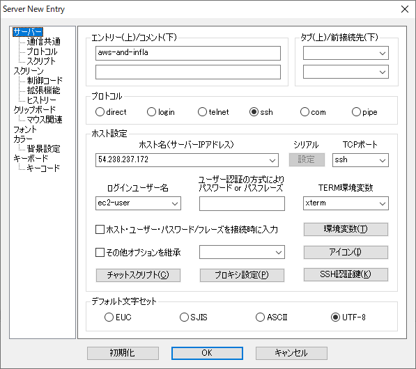
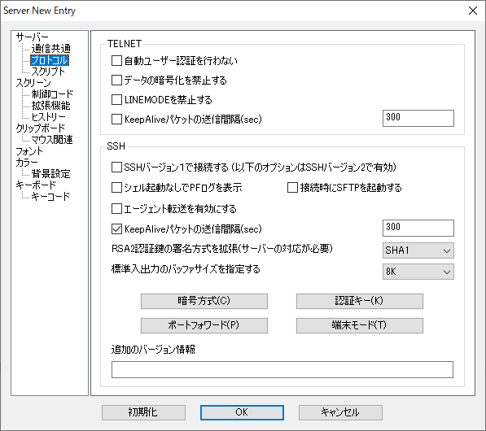
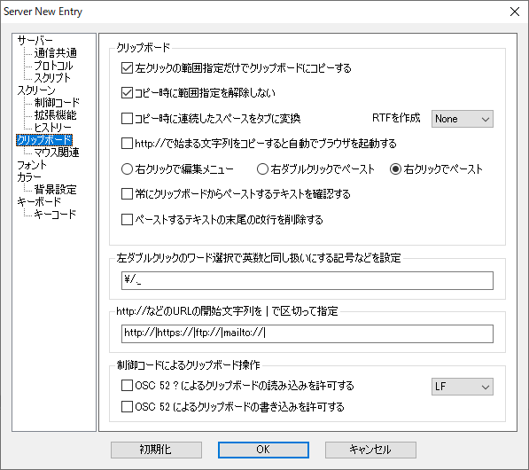
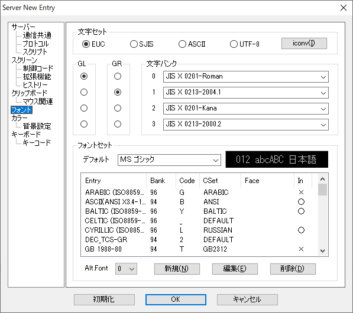

# [section04]【EC2】Web サーバーを構築しよう

パプリックサブネットに Web サーバを設置する

## EC2 インスタンスを設置

- EC2（Elastic Compute Cloud）とは  
   AWS クラウド上の仮想サーバー  
   インスタンスとは EC2 から立てられたサーバのこと。
  - 特徴  
     数分で起動し、従量課金制（1 時間または秒単位）  
     サーバー追加・削除・マシンスペックの変更も数分で可能  
     OS より上のレイヤについては自由に設定可能
  - 作成手順
    1.  AMI の選択
    2.  インスタンスタイプの選択
    3.  ストレージの追加
    4.  セキュリティグループの設定
    5.  SSH キーペアの設定
- AMI（Amazon Machine Image）とは  
   インスタンス起動に必要な情報が入った OS イメージ  
   サーバのテンプレートのようなもの
  - 概要  
     AMI に入っている OS のデータを使ってそれをもとに EC2 インスタンスを作成する  
     AMI があることで OS の導入が不要になる
  - 特徴  
     AWS やサードパーティが AMI を提供  
     自前のカスタム AMI も作成可能  
     カスタム AMI から何代でも EC2 インスタンスを起動可能
- インスタンスタイプとは  
   サーバーのスペックを定義したもの
  - 概要  
     インスタンスタイプにより、CPU/メモリ/ストレージ/ネットワーク帯域が異なる  
     インスタンスタイプによって料金が異なる（スペックが高いほど料金も高い）  
     アクセス数などに応じて必要なスペックのインスタンスタイプを選択する       
     
- ストレージとは  
   サーバーデータの保存場所  
   EC2 のストレージには 2 種類ある
  - EBS（Elastic Block Store）  
     高い可用性と耐久性を持つストレージ  
     他のインスタンスに付け替え可能  
     EC2 インスタンスを Stop/Terminate しても EBS は保存可能  
     Snapshot と取得して S3 に保存可能  
     EBS の費用が別途発生  
     OS や DB などの永続性と耐久性が必要なデータを置く
  - インスタンスストア  
     インスタンス専用の一時的なストレージ  
     他のインスタンスに付け替えることができない  
     EC2 インスタンスを Stop/Terminate するとクリアされる  
     追加費用無し（無料）  
     なくなってはいけないデータは置かない  
     一時ファイル、キャッシュなど失われても問題がないデータを置く
- 操作手順  
   AWS マネジメントコンソール＞ EC2 ＞インスタンス＞インスタンスの作成
  1.  AMI の選択
      「Amazon Linux 2 AMI (HVM), SSD Volume Type」を選択  
      （無料利用枠の対象）
  2.  インスタンスタイプの選択  
      「t2.micro」を選択して次のステップへ  
      （無料利用枠の対象）
  3.  インスタンスの詳細の設定  
      今回の設定項目は以下
      - ネットワーク：作成した VPC を選択
      - サブネット：作成したサブネット（public）
      - キャパシティーの予約：なし
      - ネットワークインターフェイス
        - プライマリ IP：10.0.10.10
          設定が完了したら次のステップへ
  4.  ストレージの追加  
      特に変更点はなし  
      次のステップへ
  5.  タグの追加  
      タグの追加を選択してキーと値を設定する  
      次のステップへ
  6.  セキュリティグループの設定  
      新しいセキュリティグループを作成するを選択してセキュリティグループ名を設定  
      確認と作成を選択
  7.  インスタンス作成の確認  
      作成内容を確認して問題がなければ「起動」を選択  
      キーペア作成のポップアップが表示されたら「新しいキーペアの作成」を選び、キーペア名を設定して「キーペアのダウンロード」を選択  
      ※再ダウンロードできないので保管に注意  
      ダウンロードを確認したら、「インスタンスの作成」を選択  
      「インスタンスの表示」を選択して作成したインスタンスが一覧に表示されていることを確認  
      インスタンスの状態が[running]となっていれば起動中となる  
      ステータスチェックの状態が[初期化しています]から[2/2 のチェックに合格しました]と表示されるとネットワークの疎通確認が取れたこととなる  
      （クレジットカード決済の場合ここで検証のため 1 円の請求が発生するかも…）

## SSH について

- SSH とは  
  サーバーとパソコンをセキュアに繋ぐサービスのこと  
  通信内容が暗号化された遠隔ログインシステム  
  EC2 にログインするときは SSH を使用する

## 公開鍵認証について

サーバー作成者本人だけがログインできように、EC2 では SSH ログイン時に公開鍵認証を行う

- 公開鍵認証とは
  サーバーへのログイン時に認証を行う仕組み  
   ユーザー名とパスワードを使用した認証と比べセキュリティ性が高い  
   公開鍵暗号（秘密鍵と公開鍵）を用いて認証を行う  
   公開鍵はサーバーが保有し、秘密鍵を持っているユーザーだけログイン可能

## SSH で EC2 インスタンスに接続

- ターミナルソフトのインストール  
   [rlogin インストール手順](http://nanno.dip.jp/softlib/man/rlogin/#INSTALL)
- rlogin を用いたサーバーログイン  
   rlogin を起動＞新規
  - エントリー（上）/コメント（下）：上段に[aws-and-infla]を入力
  - ホスト名（サーバー IP アドレス）：インスタンスの IP アドレス  
    AWS マネジメントコンソール＞ EC2 ＞インスタンス＞インスタンスを選択して IPv4 パブリック IP の IP アドレスを入力
  - ログインユーザー名：ec2-user
  - SSH 認証鍵：EC2 作成時に取得したキーペアを指定（拡張子が.pem のもの）  
        
  - 左側のプロトコルを選択して[KeepAlive パケットの送信間隔（sec）]にチェックをする  
        
  - 左側のクリップボードを選択して[左クリックの範囲指定だけでクリップボードにコピーする],[コピー時に範囲指定を解除しない],[右クリックでペースト]にチェックをする  
        
  - 左側のフォントを選択して文字セットを[UTF-8]にする    
        
    初回起動時に公開鍵の確認ポップアップが表示されたら[接続する]を選択     
- rlogin によるサーバー切断方法  
   `exit`コマンドでサーバー接続を切断することができる
- rlogin によるサーバー再接続  
   ファイルタブから[サーバーに接続]＞サーバー選択＞ OK

## ポート番号について

- ポート番号とは  
   プログラムのアドレス  
   同一コンピュータ内で通信を行うプログラムを識別するときに利用される
- ポート番号の決め方

  1.  標準で決められている番号

      - 代表的なプログラムが使うポート番号はあらかじめ決められている
      - ウェルノウンポート番号と呼ばれる
      - ウェルノウンポート番号は 0-1023 までのいずれかの整数値を取る
      - 例）SSH:22 番 / SMTP:25 番 / HTTP:80 番 / HTTPS:443 番
      - 接続元（クライアント）が接続先のポート番号を省略したときはこのウェルノウンポート番号が使用される

  2.  動的に決まる番号

      - サービスを提供する側（サーバー）はポート番号が決まっている必要があるが、接続元（クライアント）のポート番号は決まってなくてもよい
      - クライアントのポート番号は、OS が他のポート番号と被らないようランダムに決めている
      - 動的に割り当てる番号は 49142-65535 までのいずれかの整数値を取る

- ポート番号を確認する  
   rlogin でサーバーに接続して以下コマンドを実行
  - lsof コマンド  
    オープンしているファイルを一覧表示するコマンド  
    どのポート番号でどのプログラムが待ち受けているのかを一覧表示する  
     `sudo lsof -i -n -P`
  - 出力結果の見方      
      NAME欄の後に      
      [LISTEN]とある項目は他のコンピュータから待ち受けているポート      
      [ESTABLISHED]とある項目は相手側と現在通信中になっているポート     
## Apacheのインストール    
   - EC2インスタンスのライブラリアップデート    
      下記コマンドでアップデートを実施する      
      `sudo yum update -y`
   - Apacheのインストール     
      下記コマンドでApacheをインストール     
      `sudo yum -y install httpd`      
   - Apacheの起動    
      下記コマンドでApacheを起動    
      `sudo systemctl start httpd.service`      
   - Apacheの起動確認      
      下記コマンドでApacheが起動しているか確認     
      `sudo systemctl status httpd.service`     
      Active欄がactive（running）となっていることを確認     
      プロセスを確認してApacheの起動を確認っする手段もある。      
      それは以下コマンド      
      `ps -axu`
      出力結果の右側の欄に[/usr/sbin/httpd]があればApacheが起動しているということになる   
      出力結果を絞り込むには以下コマンド     
      `ps -axu | grep httpd`   
   - Apacheを自動起動する設定    
      サーバー起動時にApacheも起動するようにする      
      `sudo systemctl enable httpd.service`     
   - Apacheの自動起動設定の確認     
      下記コマンドを実施して[enabled]と出力されれば設定は正常に行われている      
      `sudo systemctl is-enabled httpd.service`    

## ファイアウォールの設定
   - ファイアウォールとは     
      ネットワークを不正アクセスから守るために、必要な通信以外は遮断する機能の総称     
   - ファイアウォールを設定する     
      AWSマネジメントコンソール＞EC2＞インスタンス＞インスタンスを選択＞セキュリティグループの[aws-and-infla-web]を開く＞インバウンドタブの[編集]を選択＞ルールの追加を選択      
      下記に変更して保存を選択      
      `タイプ：HTTP / ソース：任意の場所`    
      インスタンスのIPアドレスにブラウザでアクセスしてApacheのテストページが開かれれば正常に設定が完了している状態    

## Elastic IPアドレスでIPアドレスを固定する     
   EC2インスタンスのパプリックIPアドレスは起動・停止すると別のIPアドレスが割り当てられてしまう。      
   Elastic IPアドレスを使用することでIPアドレスを固定することができる。    
   - Elastic IPアドレスとは      
      インターネット経由でアクセス可能な固定グローバルIPアドレスを取得することができ、インスタンスに付与できるサービス     
      そのインスタンスを削除するまではそのIPアドレスを使用し続けることができる      
      Elastic IPアドレスはEC2インスタンスに関連付けられ、そのインスタンスが起動中であれば無料（そうでなければ課金される）     
      ※Elastic IPアドレスを使用しないときは開放しておくこと    
   - Elastic IPアドレスの確保        
      AWSマネジメントコンソール＞EC2＞Elastic IP＞新しいアドレスの割り当て＞割り当てを選択           
   - 確保したElastic IPアドレスをEC2インスタンスに割り当てる      
      確保したElastic IPアドレスを選択＞アクション＞アドレスの関連付け     
      リソースタイプ/インスタンス/プライベートIPをそれぞれ設定して[関連付け]を選択     
      関連付けたElastic IPアドレスをブラウザで入力してページが表示されることを確認する    
   - Elastic IPアドレスを使用しない場合      
      Elastic IPアドレスを選択＞アクション＞アドレスの関連付けの解除＞アドレスの開放      
   - インスタンスの停止    
      インスタンスを選択＞アクション＞インスタンスの状態＞停止    
      インスタンスの状態が[stopping]になっていることを確認     
      