# [section07]【EC2】WordPress を構築しよう

web サーバーに WordPress をインストールする

## WordPress 用のデータベース作成

- データベース作成  
   RLogin を用いて WordPress をインストールする

  - Web サーバーから RDS へ mysql コマンドで接続  
     AWS マネジメントコンソール＞ RDS ＞データベース＞ DB を選択  
     接続とセキュリティにあるエンドポイントを控える  
     下記コマンドを実施  
     `mysql -h [控えたエンドポイント] -u [マスターユーザー名] -p`  
     パスワードを求められるので入力  
     Welcome メッセージが表示されれば接続完了
  - MySQL にデータベースを作成する  
     以下 create 文で DB を作成する  
     `CREATE DATABASE aws_and_infla DEFAULT CHARACTER SET utf8 COLLATE utf8_general_ci;`  
     DB の一覧を表示して作成されていることを確認する  
     `SHOW DATABASES`

- ユーザー作成

  - WordPress 用のユーザーを作成する
    以下 create user 文でユーザーを作成する  
     `CREATE USER 'aws_and_infla'@'%' IDENTIFIED BY '[任意のパスワード]'`

- ユーザーに権限を付与

  - 作成したユーザーに対して DB へのアクセス権限を付与して操作可能にする
    以下 grant 文で権限を付与する  
     `GRANT ALL ON aws_and_infla.* TO 'aws_and_infla'@'%';`

- 設定した変更を反映する

  - Mysql に変更した設定を反映する  
     以下 flush 文で設定を反映する  
     `FLUSH PRIVILEGES;`

- ユーザーの確認
  - 作成したユーザーが正常に作成されていることを確認する  
     以下 select 文でユーザーの一覧を表示する  
     `SELECT USER , host FROM mysql.user;`

## WordPress をインストールする

- ライブラリのインストール  
   以下コマンドで[php7.2]をインストールする  
   （WordPress を利用する上で php5.6 以降が必要なため）  
   `sudo amazon-linux-extras install -y php7.2`

  - php 関連の必要ライブラリをインストールする  
     以下コマンドでライブラリをインストールする  
     `sudo yum install -y php php-mbstring`

- WordPress のダウンロード  
   ホームディレクトリで以下コマンドを実施し最新の WordPress をダウンロードする  
   wget コマンドを利用することで url を指定したファイルを取得することができる  
   `wget https://ja.wordpress.org/latest-ja.tar.gz`  
   ls コマンドでファイルが取得できていることを確認する

- WordPress の解凍  
   以下コマンドで上記で取得したファイルを解凍する  
   `tar xzvf latest-ja.tar.gz`  
   ls コマンドで解凍されていることを確認する

- WordPress のプログラムを Apache から見える場所に配置  
   上記で回答したファイルを以下コマンドで指定した場所にコピーする  
   `cd wordpress`  
   `sudo cp -r * /var/www/html`

- WordPress ファイルの所有者・グループを変更  
   以下コマンドを実施して所有者と所有しているグループを Apache に変更する
  `sudo chown apache:apache /var/www/html/ -R`

- Apache の再起動  
   Apache を再起動して変更を反映する  
   Apache の起動状態を確認する（Active: active (running)となっていれば起動している）  
   `sudo systemctl status httpd.service`  
   起動していない場合は以下コマンドで Apache を起動する  
   `sudo systemctl start httpd.service`  
   以下コマンドで Apache を再起動する  
   `sudo systemctl restart httpd.service`

## WordPress を設定する

- ドメイン名にアクセス  
   Route53 で取得したドメインにアクセス  
   ※ElasticIP を再取得している場合は Route53 の A レコードにて IP アドレスの更新が必要  
   `https://kaitobono.work`

- データベース接続情報を入力  
   以下項目を設定する

  1.  データベース名  
      →DB を作成したときと同様の情報
  2.  データベースのユーザー名
      →DB を作成したときと同様の情報
  3.  データベースのパスワード
      →DB を作成したときと同様の情報
  4.  データベースホスト
      →aws マネジメントコンソール＞ RDS ＞データベース＞ DB を選択＞エンドポイントをコピペ
  5.  テーブル接頭辞 (1 つのデータベースに複数の WordPress を作動させる場合)  
      → テーブル作成時名前の頭につける接頭辞を設定

  設定後に編集したい場合は「wp-config.php」ファイルをサーバー上で編集することで可能

- 必要情報を入力  
   以下を任意に設定する
  1.  サイトのタイトル
  2.  ユーザー名
  3.  パスワード
  4.  メールアドレス
  5.  検索エンジンでの表示

## なぜ WordPress のサイトが表示されるのか

- WordPress のサイトが表示される流れ  
  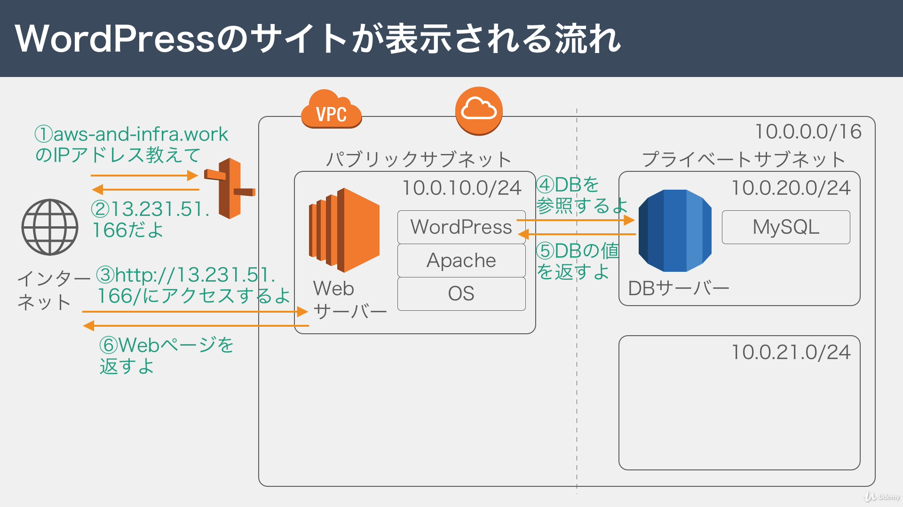

## TCP/IP について

インターネット通信を実現しているのが TCP/IP プロトコル

- プロトコルとは  
  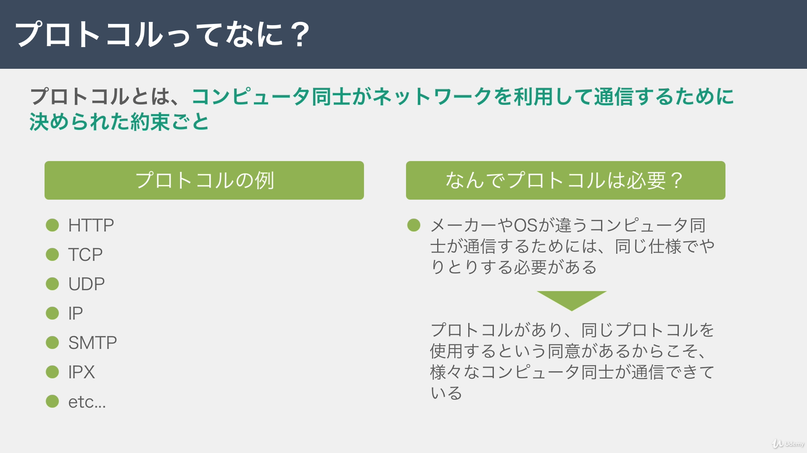
- TCP/IP の階層モデル  
  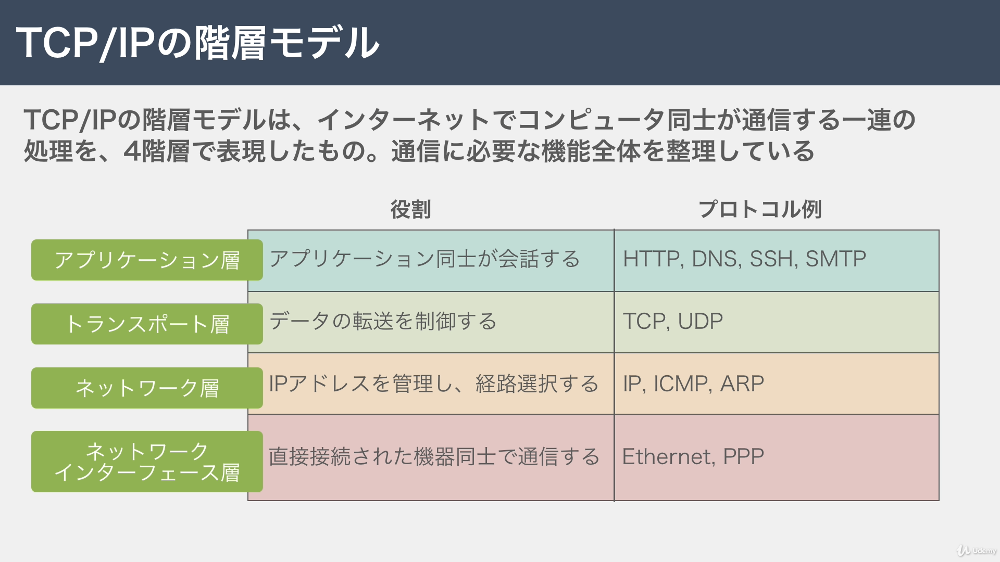

## HTTP について

アプリケーション層のプロトコル  
インターネットで HTML などのコンテンツの送受信に用いられる通信の約束事  
クライアントが HTTP リクエスとを送り、それに対してサーバーが HTTP レスポンスを返す。  
そのリクエスト・レスポンスの書き方が HTTP の正体

- HTTP リクエストの中身  
  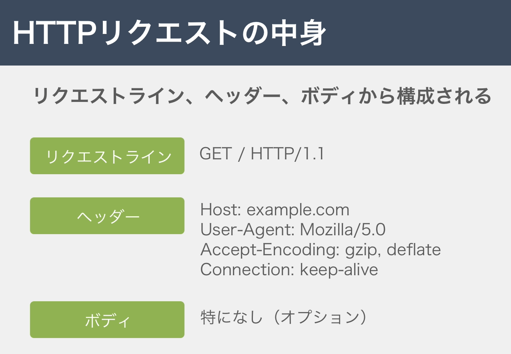
- HTTP レスポンスの中身  
  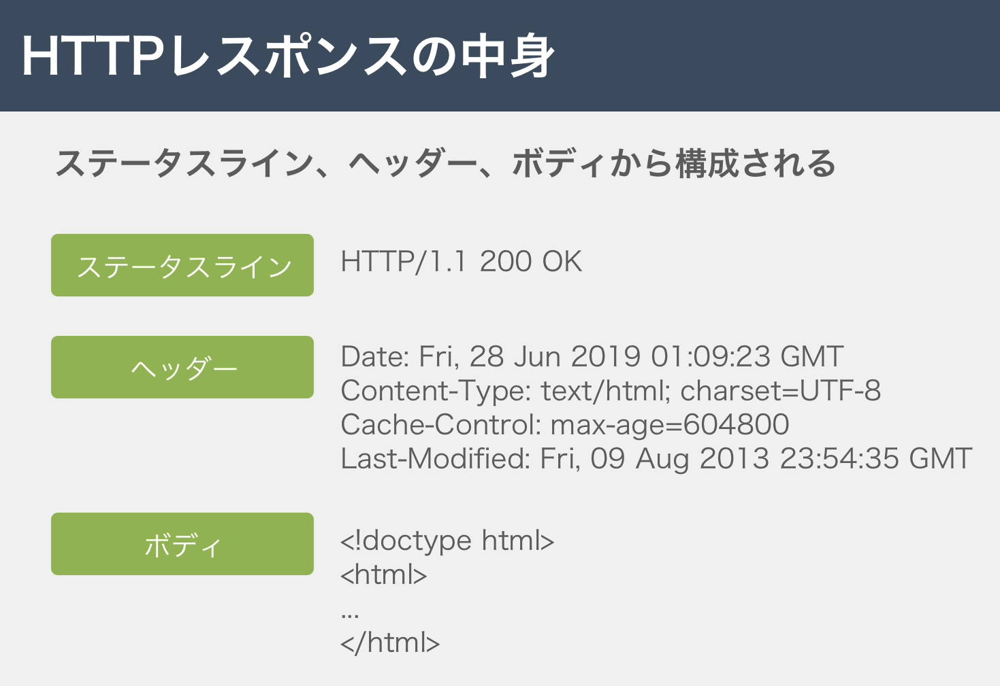

## TCP と UDP について

トランスポート層のプロトコル  
 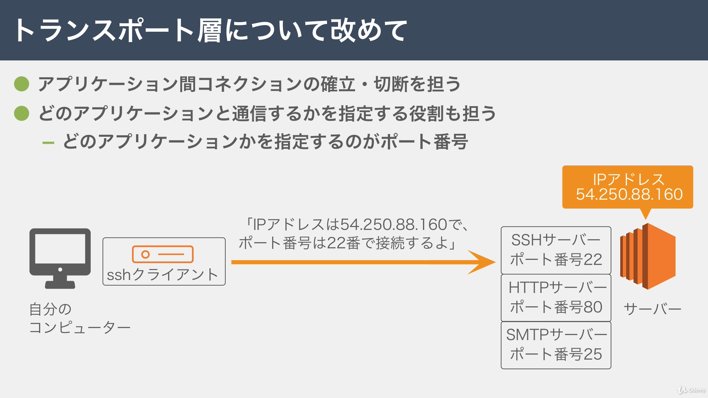  
 通信の特性により使い分ける

- TCP について  
   信頼性のある通信を提供  
   信頼性を保つために送信するパケットの順序制御や再送制御を行う  
   信頼性のある通信を実現する必要がある場合に使用する  
  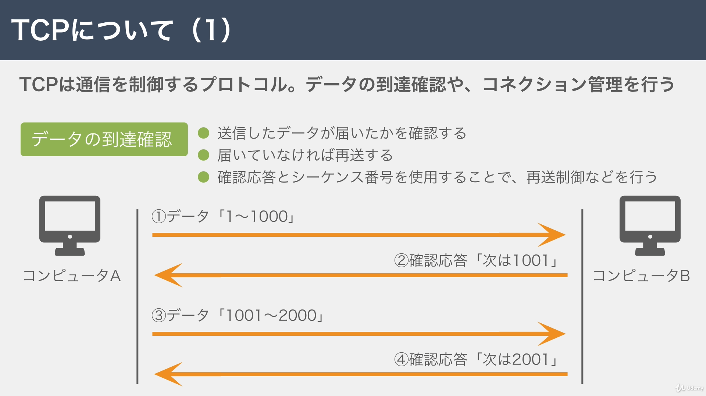 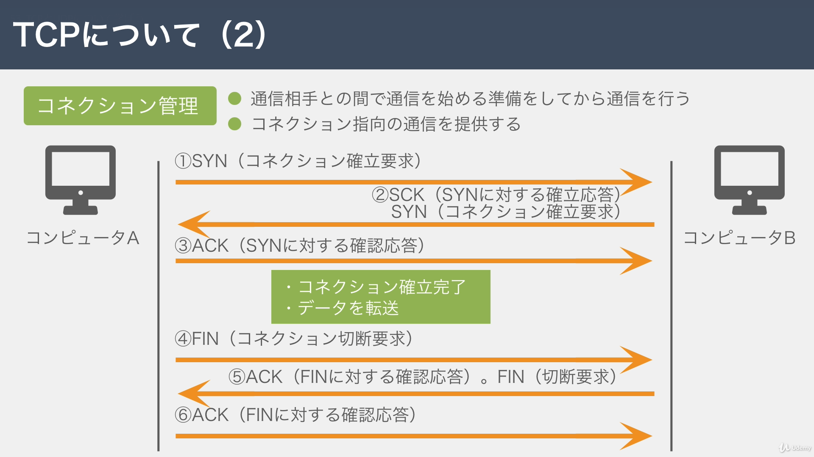
- UDP について  
   信頼性のない通信  
   送信するだけでパケットが届いたかは保証しない  
   高速性やリアルタイム性を重視する通信で使用する  
  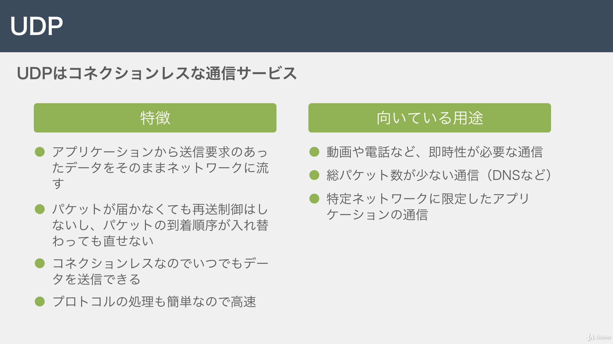

- ヘッダーのフォーマット  
  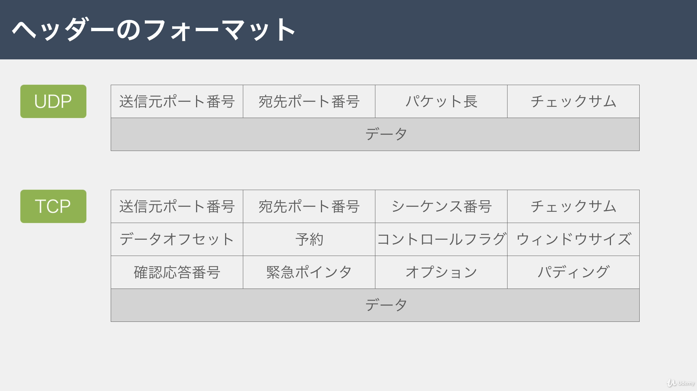

## IP について

ネットワーク層のプロトコル  
 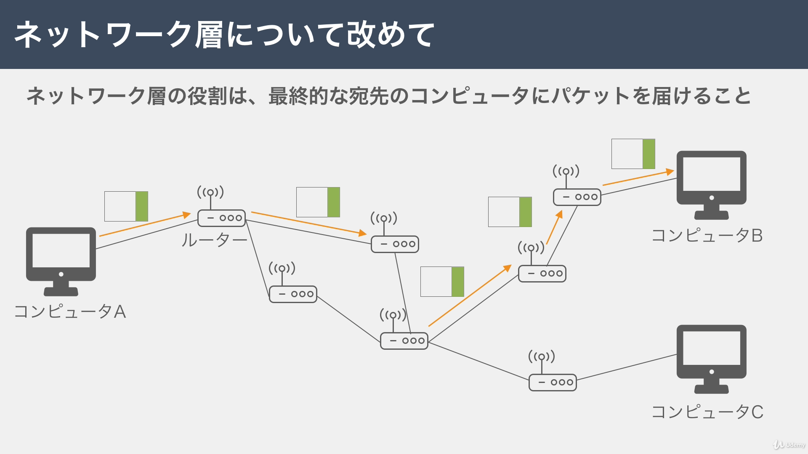

- IP の役割 ①IP アドレス  
  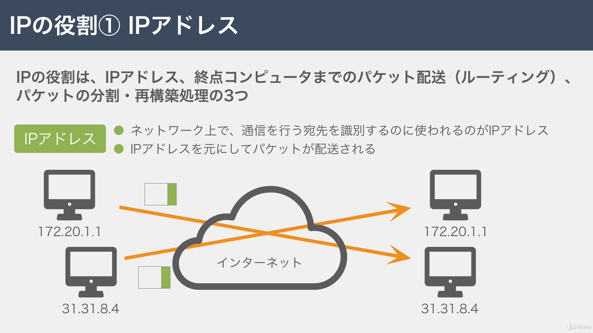
- IP の役割 ② ルーティング  
  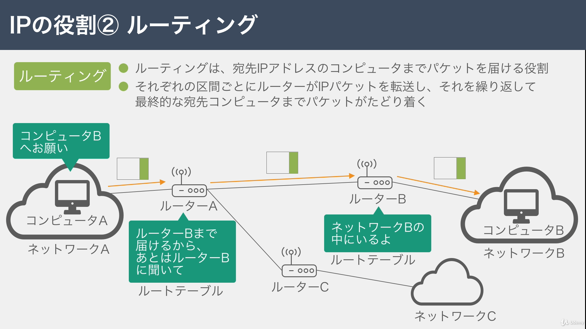
- IP の役割 ③ パケットの分割・再構築処理  
  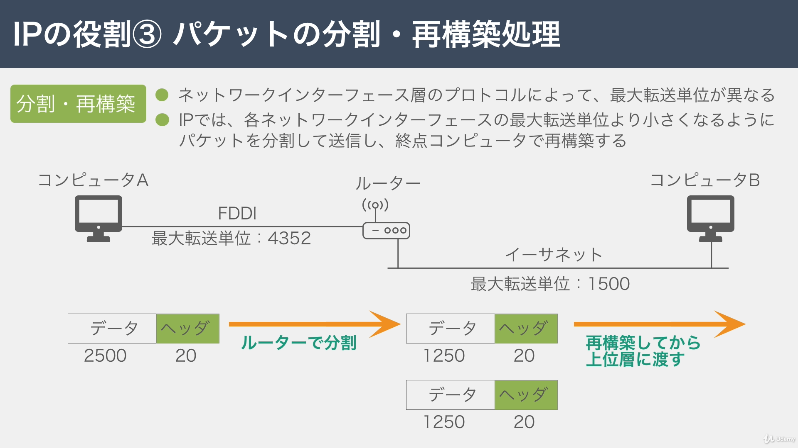
- ヘッダーのフォーマット（IPv4）  
  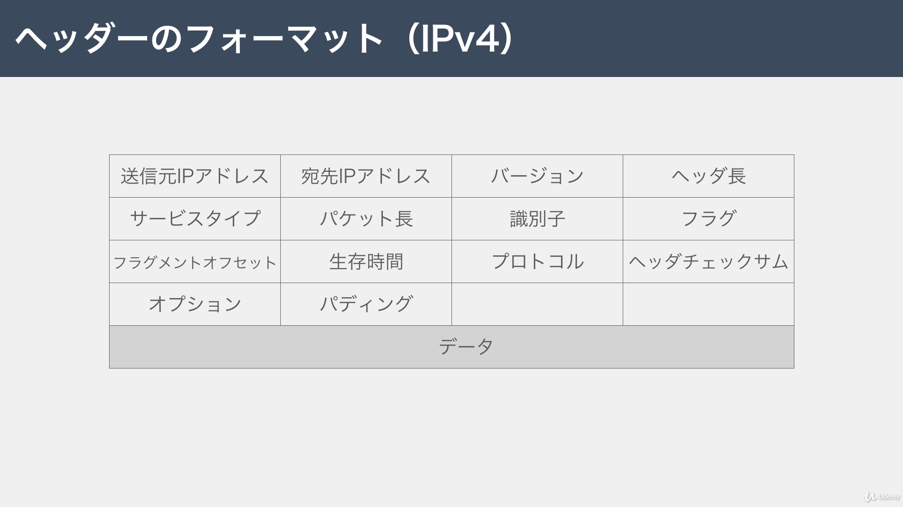
