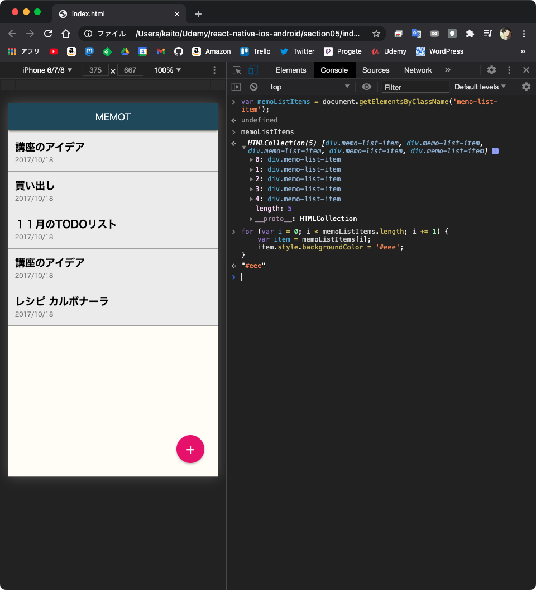

# セクション 5:プログラミングの基本

## JavaScript で HTML を変更する

- HTML の ClassName を取得して変数に代入する
  ```
  var memoListItems = document.getElementsByClassName('memo-list-item');
  ```
- for 文を用いて HTML の背景を変更する
  ```
   for (var i = 0; i < memoListItems.length; i += 1) {
     var item = memoListItems[i];
     item.style.backgroundColor = '#eee';
     }
  ```
  
- ボタンにイベントを設定する    
  ```
  button.onclick = function() {
    console.log('clicked!')
  }
  ```
  
